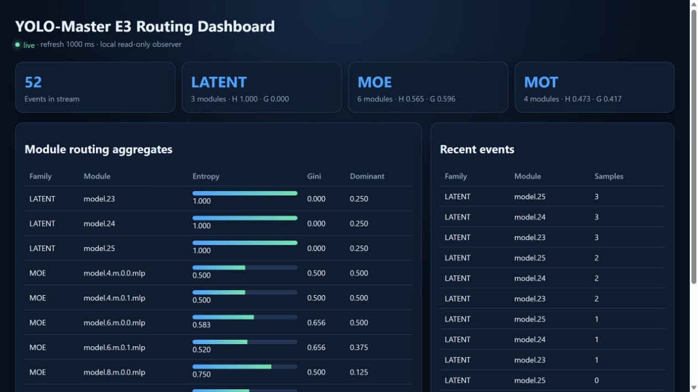

# E3 P1 独立仓库实验报告

## 结论

正式运行 `p1-20260901-cpu-split` 为 `PASS`。本结论只适用于固定配置下的 CPU、batch=2、imgsz=64 训练路径微基准与本地只读面板，不外推到完整 epoch 或 GPU。

| Family | 参数量 | 测量对数 | AB/BA | 中位成对 slowdown | Bootstrap 95% CI | 结论 |
|---|---:|---:|---:|---:|---:|---|
| MoE | 5,115,336 | 30 | 15/15 | -0.903% | [-7.987%, 8.097%] | PASS |
| MoT | 2,927,512 | 30 | 15/15 | 5.087% | [-5.648%, 9.510%] | PASS |
| Latent | 5,478,423 | 30 | 15/15 | 1.196% | [-5.536%, 5.670%] | PASS |

判据在运行前固定为“逐对 slowdown 中位数小于 10%”。三族共 90 对 loss 全部通过 `rtol=atol=1e-6` 等价检查，AB/BA 顺序均衡，模型完整状态哈希一致，观察 hook 全部移除。负值不能解释为 hook 加速，只能说明 CPU 抖动可大于微小开销。

## 面板验证

- 数据源：P0 `p0-20260831-cpu-multisample/routing-all.jsonl`。
- 数据源 SHA-256：`ca35ebbb498948a80e8b9450c32579a57d20bbc0787b145d67518c422a904f07`。
- HTTP smoke：主页、健康检查与 API 均通过，状态码 200。
- API：52 条事件、3 个 family；浏览器页面聚合 13 个模块。

## 方法边界

计时区域包含真实模型 train-mode forward 和可微 surrogate backward；不含模型构造、hook 注册/移除、optimizer step、磁盘序列化与面板 HTTP。每族 5 对 warmup 不计时，30 对正式测量按 AB/BA 交替，固定 seed bootstrap 5000 次得到中位数的 95% 区间。

## 失败证据与修复

1. `p1-20260831-cpu-failed-no-moe-snapshot`：MoE 训练态没有预期的外层 snapshot，正式计时前 hard-fail；修复为从真实 nested router 的 weights/indices 构造带来源标记的 fallback。
2. `p1-20260831-cpu-v2-failed-latent-state-hash`：Latent extra state 含字典，旧状态哈希器无法处理；修复为递归覆盖 tensor、dict、list、tuple 与 scalar。失败运行中的局部数字不进入正式结论。

## 证据索引

- [`summary.json`](../artifacts/p1/p1-20260901-cpu-split/summary.json)：判据、结果与方法摘要。
- [`benchmark-pairs.jsonl`](../artifacts/p1/p1-20260901-cpu-split/benchmark-pairs.jsonl)：90 对原始记录。
- [`dashboard-source.json`](../artifacts/p1/p1-20260901-cpu-split/dashboard-source.json)：跨仓库 P0 数据溯源。
- [`dashboard-smoke.json`](../artifacts/p1/p1-20260901-cpu-split/dashboard-smoke.json)：HTTP smoke 结果。
- [`environment.json`](../artifacts/p1/p1-20260901-cpu-split/environment.json)：Python、PyTorch、平台与 git 状态。
- [`manifest.sha256.json`](../artifacts/p1/p1-20260901-cpu-split/manifest.sha256.json)：14 个正式文件的大小与 SHA-256。
- [`observer-overhead.png`](../artifacts/p1/p1-20260901-cpu-split/observer-overhead.png)：三族开销图。
