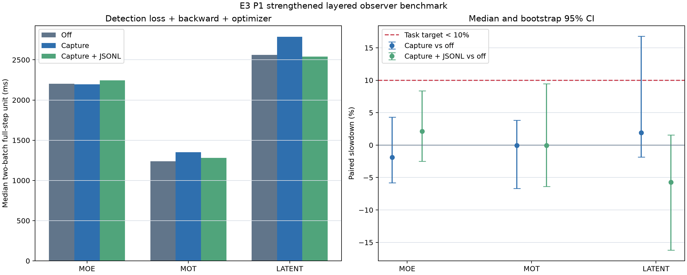
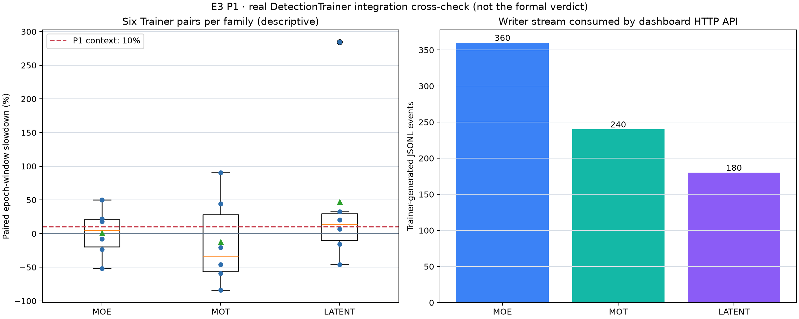

# E3 P1 独立仓库实验报告

## 加强正式实验结论

正式运行 `p1s-20260901-cpu-fullstep-v1` 为 `PASS / STRONG`。与下文首轮隔离微基准不同，本轮使用 4 张 coco8 val 图及真实 YOLO 标签；每个 step 的计时覆盖 `DetectionModel.loss`、backward、梯度裁剪、官方分组 SGD optimizer step，以及 `capture_jsonl` 条件的逐 step JSON 编码、写入和 flush。

| Family | 参数量 | Routed 模块 | 正式 pair | 主条件中位 slowdown | Bootstrap 95% CI | 结论 |
|---|---:|---:|---:|---:|---:|---|
| MoE | 5,115,336 | 6 | 30 | 2.113% | [-2.514%, 8.361%] | PASS / STRONG |
| MoT | 2,927,512 | 4 | 48 | -0.050% | [-6.374%, 9.451%] | PASS / STRONG |
| Latent | 5,478,423 | 3 | 30 | -5.741% | [-16.195%, 1.570%] | PASS / STRONG |

主条件是 `capture_jsonl vs off`。任务规则仍是每族逐对 slowdown 中位数 `<10%`；加强等级要求 95% CI 上界也 `<10%`。三族均同时满足。负值只表明 CPU 抖动淹没了很小的额外工作，不能声称观察器带来加速。

### 等价性与完整性

- 三条件初始模型和 optimizer 哈希一致；108 个正式 pair 的检测总 loss、box/cls/dfl 分量、裁剪前梯度范数、pair 后模型状态与 optimizer momentum 状态全部等价。
- 事件总数与序号 hard-fail 通过：MoE 432、MoT 432、Latent 216，两个观察条件各自都从 0 全局连续到末尾；writer 三族合计 1,080 条。
- 两个固定 batch 覆盖 coco8 val 全部 4 张图，解析目标数分别为 2、1、9、5；图片和标签 SHA-256 均在 `input.json` 中。
- 正式证据共 12 项，独立重算 manifest 为 0 mismatch；正式状态为 `execution_mode=formal`、`formal_verdict_eligible=true`。

### 加强过程中的失败与修复

1. 第一次预检在真实检测 loss 初始化时失败：高层 YAML 构造留下字典型 `model.args`，而 loss 需要训练器属性配置；修复为复用官方 `get_cfg`。
2. 第二次预检跑通全步，但原始 JSONL 复核发现每个 step 后清空 collector 会让 `sequence` 重置；该结果不进入正式结论。
3. 修复为 family 全程保留事件并强制检查 `0..N-1` 连续序号。第三次预检得到 48/48 连续 MoT 事件，且明确标为 `formal_verdict_eligible=false`。

### 加强证据索引

- [`summary.json`](../artifacts/p1-strengthened/p1s-20260901-cpu-fullstep-v1/summary.json)：正式判据、三族结果、状态和事件流校验。
- [`fullstep-pairs.jsonl`](../artifacts/p1-strengthened/p1s-20260901-cpu-fullstep-v1/fullstep-pairs.jsonl)：108 个正式 pair 的三条件逐步证据。
- [`input.json`](../artifacts/p1-strengthened/p1s-20260901-cpu-fullstep-v1/input.json)：4 张图片、标签、目标数和哈希。
- [`writer-events-*.jsonl`](../artifacts/p1-strengthened/p1s-20260901-cpu-fullstep-v1/)：三族真实 writer 事件流。
- [`manifest.sha256.json`](../artifacts/p1-strengthened/p1s-20260901-cpu-fullstep-v1/manifest.sha256.json)：12 项正式证据的大小与 SHA-256。

## 真实 DetectionTrainer 集成交叉验证

运行 `p1e-20260903-cpu-trainer-v3` 为 `PASS`，但明确标记 `execution_mode=integration_crosscheck`、`formal_verdict_eligible=false`。这轮不重新裁定 `<10%`，而是验证同一观察链路进入官方 `DetectionTrainer` 后仍保持训练等价并能被面板消费。

### 覆盖范围与数量

- 三族各 2 对 warmup、6 对 measured，AB/BA=3/3；每个条件独立构造 Trainer，共 48 次执行。
- 每次连续 5 个 coco8 train epoch，共 10 batch、10 optimizer step；覆盖官方 dataloader、preprocess、检测 loss、backward、optimizer、EMA 与 callbacks。
- `capture_jsonl` 在每个 batch 中编码/write，并在 batch end flush；measured writer 事件为 MoE 360、MoT 240、Latent 180。
- 连同 warmup，原始合并流共 1,040 条。dashboard HTTP smoke 为 200 且识别三族；API 的 `event_count=1000` 是默认最近窗口上限，不是丢失，原始 JSONL 和离线 snapshot 均保留全部 1,040 条。后续代码已显式返回源总量和 `truncated`。

### 等价性和来源验证

- 18 个 measured pair 的初始/最终 model、optimizer、EMA 哈希完全一致；原始 collated batch、loss item 序列、epoch 数、batch 数、optimizer step 数均一致。
- 运行时是官方 ref `07d330325b5a26b75aabfc75389f9bcbc0d40245` 的无 `.git` 冻结快照，因此没有用目录名冒充 commit；Trainer、detect trainer、routing protocol 和三份模型 YAML 共 6 个预注册 SHA-256 全部 `MATCH`。
- 证据目录共 36 项 manifest 条目，独立重算文件大小和 SHA-256 为 0 mismatch。

### Latent 启动缺陷及限定处理

首次三族运行在 Latent 的 `ModelEMA(deepcopy(model))` 前失败。全新 Python 进程仍可复现，检查发现三个 `LatentMixture` 在构造期 stride forward 后各留下 3 个非叶 `_last_routing_*` 张量，共 9 项，均不属于 `state_dict`。交叉验证 Trainer 仅在模型构造完成后清空这 9 个临时快照并记录 module、字段、shape 和 state-dict 归属；off/on 清单必须相同。训练首个 forward 会重新产生当前快照，不改参数或 buffer。

### 描述性时延为什么不作新结论

5-epoch epoch-window 的中位 slowdown 为 MoE `4.948%`、MoT `-33.209%`、Latent `13.629%`；逐对总范围约 `-84%～+284%`。正负极端同时出现，说明本机 CPU、coco8 每 epoch 仅 2 batch 的调度噪声仍显著高于观察器增量。这里不能据 Latent 中位数判正式失败，也不能据 MoT 负值声称加速；正式 P1 开销结论仍由预注册、重复数更高且带 bootstrap CI 的 108 对加强实验给出。

报告图由同一 `summary.json` 重绘；右侧事件数量使用中性 family 配色，避免把事件量错误解释为 `<10%` 判据。运行目录中的原始生成图保持不变。

证据索引：[`summary.json`](../artifacts/p1-engine/p1e-20260903-cpu-trainer-v3/summary.json)、[`trainer-runs.jsonl`](../artifacts/p1-engine/p1e-20260903-cpu-trainer-v3/trainer-runs.jsonl)、[`routing-engine-all.jsonl`](../artifacts/p1-engine/p1e-20260903-cpu-trainer-v3/routing-engine-all.jsonl)、[`runtime-inputs.json`](../artifacts/p1-engine/p1e-20260903-cpu-trainer-v3/runtime-inputs.json)、[`manifest.sha256.json`](../artifacts/p1-engine/p1e-20260903-cpu-trainer-v3/manifest.sha256.json)。

## 首轮隔离微基准

### 结论

正式运行 `p1-20260901-cpu-split` 为 `PASS`。本结论只适用于固定配置下的 CPU、batch=2、imgsz=64 训练路径微基准与本地只读面板，不外推到完整 epoch 或 GPU。

| Family | 参数量 | 测量对数 | AB/BA | 中位成对 slowdown | Bootstrap 95% CI | 结论 |
|---|---:|---:|---:|---:|---:|---|
| MoE | 5,115,336 | 30 | 15/15 | -0.903% | [-7.987%, 8.097%] | PASS |
| MoT | 2,927,512 | 30 | 15/15 | 5.087% | [-5.648%, 9.510%] | PASS |
| Latent | 5,478,423 | 30 | 15/15 | 1.196% | [-5.536%, 5.670%] | PASS |

判据在运行前固定为“逐对 slowdown 中位数小于 10%”。三族共 90 对 loss 全部通过 `rtol=atol=1e-6` 等价检查，AB/BA 顺序均衡，模型完整状态哈希一致，观察 hook 全部移除。负值不能解释为 hook 加速，只能说明 CPU 抖动可大于微小开销。

## 面板验证

- 数据源：P0 `p0-20260831-cpu-multisample/routing-all.jsonl`。
- 数据源 SHA-256：`ca35ebbb498948a80e8b9450c32579a57d20bbc0787b145d67518c422a904f07`。
- HTTP smoke：主页、健康检查与 API 均通过，状态码 200。
- API：52 条事件、3 个 family；浏览器页面聚合 13 个模块。

## 方法边界

计时区域包含真实模型 train-mode forward 和可微 surrogate backward；不含模型构造、hook 注册/移除、optimizer step、磁盘序列化与面板 HTTP。每族 5 对 warmup 不计时，30 对正式测量按 AB/BA 交替，固定 seed bootstrap 5000 次得到中位数的 95% 区间。

## 失败证据与修复

1. `p1-20260831-cpu-failed-no-moe-snapshot`：MoE 训练态没有预期的外层 snapshot，正式计时前 hard-fail；修复为从真实 nested router 的 weights/indices 构造带来源标记的 fallback。
2. `p1-20260831-cpu-v2-failed-latent-state-hash`：Latent extra state 含字典，旧状态哈希器无法处理；修复为递归覆盖 tensor、dict、list、tuple 与 scalar。失败运行中的局部数字不进入正式结论。

## 证据索引

- [`summary.json`](../artifacts/p1/p1-20260901-cpu-split/summary.json)：判据、结果与方法摘要。
- [`benchmark-pairs.jsonl`](../artifacts/p1/p1-20260901-cpu-split/benchmark-pairs.jsonl)：90 对原始记录。
- [`dashboard-source.json`](../artifacts/p1/p1-20260901-cpu-split/dashboard-source.json)：跨仓库 P0 数据溯源。
- [`dashboard-smoke.json`](../artifacts/p1/p1-20260901-cpu-split/dashboard-smoke.json)：HTTP smoke 结果。
- [`environment.json`](../artifacts/p1/p1-20260901-cpu-split/environment.json)：Python、PyTorch、平台与 git 状态。
- [`manifest.sha256.json`](../artifacts/p1/p1-20260901-cpu-split/manifest.sha256.json)：14 个正式文件的大小与 SHA-256。
- [`observer-overhead.png`](../artifacts/p1/p1-20260901-cpu-split/observer-overhead.png)：三族开销图。
